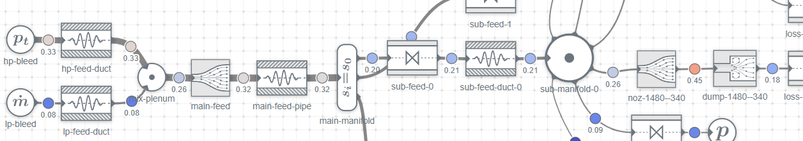

# Nefes — network solver for reacting compressible flows and thermoacoustics
[](LICENSE)



Nefes models a fluid system as a directed graph of lumped elements.
It solves the steady mean flow and the linear perturbations about that mean (acoustics, entropy, and composition) without resolving the full three-dimensional field.
The perturbation layer is the linearization of the same mean-flow residual, so the two stay consistent by construction.

The companion browser UI [Nemo](https://github.com/cetinalanyalioglu/Nemo) builds Nefes networks interactively.

## Capabilities

- Reacting compressible mean flows in the subsonic regime, including choking at a sonic throat
- Chemical-equilibrium thermochemistry
- Entropy and compositional (indirect) noise
- Linear stability analysis: eigenmode search (Beyn contour-integral method) and real-frequency Nyquist criterion
- Forced-response analysis
- Scattering and transfer matrices
- Identification of an unknown element's dynamic response (e.g. a flame) given a model of the rest

## Installation

Python 3.11 or newer.
The core package depends only on NumPy, SciPy, Numba, and PyYAML:

```bash
pip install -e .
```

For the examples and notebooks, install the `jupyter` extra (pulls in Plotly and a notebook stack):

```bash
pip install -e ".[jupyter]"
```

Plotting alone is available as `pip install -e ".[viz]"`.

## Documentation

See the [documentation](https://cetinalanyalioglu.github.io/Nefes/) and the [examples](https://cetinalanyalioglu.github.io/Nefes/examples/) for a quick start.
For AI assistants building or analyzing cases with Nefes, the project ships a [`nefes-user`](.claude/skills/nefes-user/SKILL.md) skill that steers them to the documented public workflow.

## Minimal example: a reacting Rijke tube

```python
import nefes
from nefes.chem import equivalence_ratio_mixture
from nefes.elements import n_tau_flame

mix = equivalence_ratio_mixture({"CH4": 1.0}, {"O2": 0.21, "N2": 0.79}, phi=0.8)
area = 0.01; length = 1.0; mdot = 0.02

net = nefes.Network(
    nefes.equilibrium(),
    nodes=[
        nefes.cat.mass_flow_inlet(mdot, 300.0, composition=mix, name="inlet"),
        nefes.cat.duct(0.25 * length, name="cold"),
        nefes.cat.equilibrium_flame(name="flame"),
        nefes.cat.duct(0.75 * length, name="hot"),
        nefes.cat.pressure_outlet(1.0e5, 300.0, name="outlet"),
    ],
    edges=[(0, 1, area), (1, 2, area), (2, 3, area), (3, 4, area)],
)
net.set_dynamic_source("flame", n_tau_flame(1.0, 4e-3, ref_edge=net.edge_between("cold", "flame")))

sol = net.solve()
assert sol.converged
modes = sol.eigenmodes(freq_band=(40.0, 400.0), growth_band=(-300.0, 300.0), isentropic=True)
print(modes.summary()[0])  # ~141 Hz, growth ~ +90 1/s
```

The full walkthrough is in [`examples/thermoacoustics/rijke_tube.ipynb`](examples/thermoacoustics/rijke_tube.ipynb).

## Contributing

```bash
pip install -e ".[dev]"
```

That pulls in the tooling used to develop and test the package.
See [CONTRIBUTING.md](CONTRIBUTING.md) for guidelines.
When changing the package itself (kernels, solver, tests, docs), use the companion [`nefes-dev`](.claude/skills/nefes-dev/SKILL.md) skill so AI assistants follow the same contracts as human contributors.
