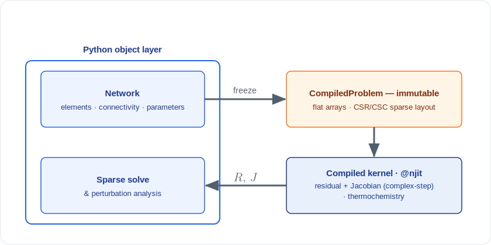

# Kernel architecture

The performance-critical core of the framework is a small set of compiled *kernels* — plain, typed functions that evaluate element residuals and their derivative seeds — rather than a hierarchy of element objects with virtual methods.
This document explains that choice and its mechanics: how an element is identified by an integer, and how one source compiles to both a real-valued and a complex-valued specialization.
The arrangement follows directly from the *kernels over objects* principle of [the design philosophy](philosophy.md): numerics live in kernels that never import the object shell, and the shell never intrudes on the inner loop; @fig-architecture shows the split at a glance.

{#fig-architecture}

## Why kernels, not objects {#sec-kernels-why}

An object-oriented element hierarchy, e.g. a base class with a virtual `residual` method overridden per element type, is perhaps the most tempting design, and it is the wrong one for this inner loop.
The residual and Jacobian are evaluated thousands of times over every edge of the network within each Newton iteration, so the inner loop must be a flat, cache-friendly sweep over typed arrays, not a walk over a tree of objects dispatching through virtual tables.
The framework therefore confines objects to the *edges* of the system — an object shell builds the network, names elements, and presents results — while the state lives on the edges as plain arrays and the equations live in compiled kernel functions.
The shell owns no numerics and the kernels import no shell, so the two evolve independently and the hot path stays free of allocation and indirection.

## Integer dispatch on a residual identifier {#sec-kernels-dispatch}

Each element type is assigned a small integer *residual identifier*, and the residual kernel dispatches on it rather than on an object's type.
The identifiers are a flat enumeration — an isentropic area change, a loss, a wall, a heat-release flame, a cavity, a transfer-matrix element, and so on — and a companion table maps each back to a human-readable name for diagnostics.
An element additionally carries an *acoustic identifier* that selects how it contributes to the perturbation operator: the default contributes only through the inherited linearization, while a duct contributes a propagation-phase stamp, and a cavity a finite-volume storage stamp (see [assembly](assembly.md#sec-assembly-stamps)).
Dispatching on an integer keeps the kernel a single compiled function with a branch on a *type tag* — which is constant across the flow state and therefore legitimate, unlike a branch on the flow state itself — so the compiler can specialize it and the inner loop pays no virtual-call cost.
Adding an element type is thus adding an identifier, a residual branch, and a catalogue constructor, with no change to the assembly, the solver, or the derivative engine.

## Dtype-generic dual compilation {#sec-kernels-dual-compilation}

The single most important property of a kernel is that it is written *once* but compiled *twice*, from the same source, in two numeric types.
A `float64` specialization evaluates the real-valued residual that the Newton iteration drives to zero, and a `complex128` specialization evaluates the same expression on a complex-stepped input to carry the derivative seed (see [the complex-step derivative](complex-step.qmd)).
Because both specializations are generated from one function body, a change to a residual automatically changes its derivative — there is no separate Jacobian code to keep in step — which is precisely the mechanism by which exact derivatives come for free.
This dual compilation is what ties the *kernels over objects* and *exact derivatives* principles together: the kernel form is what makes the dtype-generic trick possible, and the dtype-generic trick is what makes the complex-step Jacobian cheap.
It also imposes the analyticity discipline structurally, since an operation that is not defined identically on the real and complex specializations — a branch on the sign of the argument, for instance — would compile to two different functions and break the correspondence, which is the deeper reason the residuals must avoid such branches.

These kernel outputs are wired into the assembled residual vector and sparse Jacobian, and the same kernels are reused to stamp the acoustic operator (see [assembly](assembly.md)).
